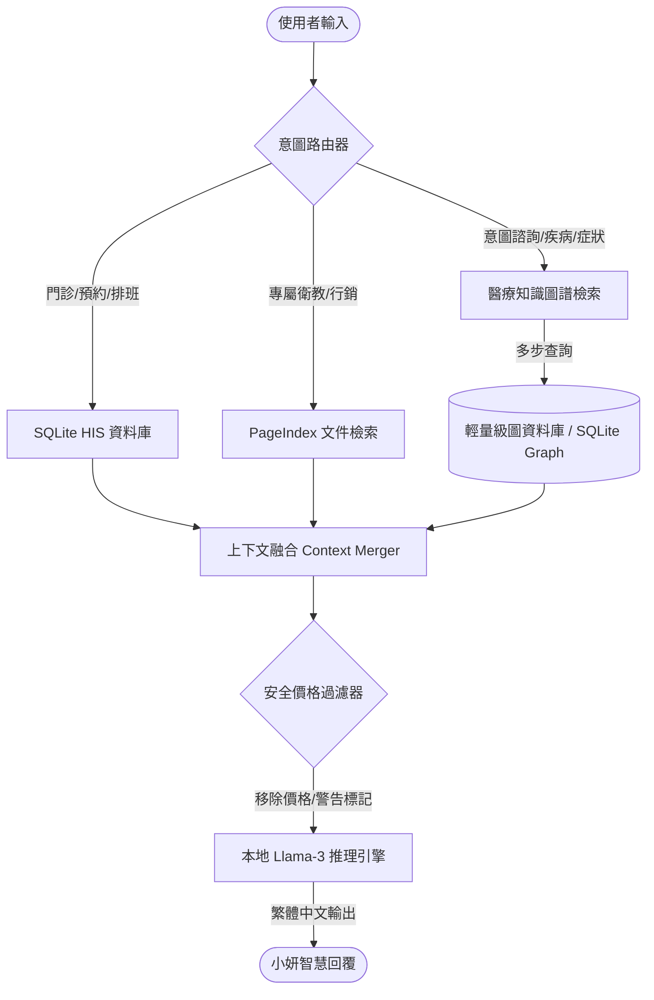

# DrtoolboxLocalServer 與 Chatbot-Knowledge-Graph 整合升級方案

本文件針對 **DrtoolboxLocalServer**（基於本地 Llama/RAG 與 SQLite HIS 的緻妍診所智慧醫療助理「小妍」系統）與 **chatbot-base-on-Knowledge-Graph**（基於 Neo4j 與傳統深度學習的醫療問答機器人）進行深度對比分析，並提出一套可行、高效且安全的整合方案（Graph-RAG）。

---

## 1. 系統現狀與對比分析

### 1.1 DrtoolboxLocalServer (小妍)
* **核心架構**：意圖路由器 (`hermes_router.py`) + 混合檢索 (`rag_engine.py`，整合 SQLite 與 `SimpleIndex` 倒排字元匹配檢索) + 本地 Llama 推理。
* **優勢**：
  * 使用大語言模型 (LLM) 進行自然語言推理，生成擬人、流暢的回答。
  * 具備嚴格的商業安全防線：**價格屏蔽機制** 與 **時效性判定**。
  * 模組化且易於本地部署，完全使用繁體中文。
* **缺點**：
  * RAG 部分為字元級 N-gram 檢索，缺乏結構化的醫療實體關聯推理能力（例如：無法自動推導「某疾病」伴隨的「某併發症」）。

### 1.2 Chatbot-base-on-Knowledge-Graph
* **核心架構**：醫療命名實體識別 (BiLSTM-CRF) + 意圖分類 (TextCNN) + Neo4j 圖資料庫 (Cypher 查詢) + 模板化回答。
* **優勢**：
  * 擁有豐富的醫療領域圖數據（包含約 4.4 萬實體、30 萬關係，涵蓋疾病、症狀、藥品、食物、檢查等）。
  * 結構化的知識圖谱能精確表示多步關係（如：疾病 $\rightarrow$ 常用藥品 $\rightarrow$ 忌吃食物）。
* **缺點**：
  * 技術棧老舊：基於 Python 3.6 和 TensorFlow 1.10，難以與現代 Python 3.10+、PyTorch/Transformers 及本地 LLM 伺服器並存。
  * 回答為模板拼接，缺乏 LLM 的靈活性與對複雜脈絡的理解。
  * 依賴 Neo4j 圖資料庫服務，部署開銷較大。

---

## 2. 整合架構設計 (Graph-RAG)

我們將不直接運行舊版的 TensorFlow 1.x 代碼，而是提取其 **醫療知識圖譜數據**，並融入 Hermes 的 RAG 流程中，構建基於 SQLite / In-memory Graph 的輕量級 **Graph-RAG**。



---

## 3. 具體整合步驟

### 階段一：數據轉換與遷移 (Neo4j $\rightarrow$ Relational SQLite)
為了避免在本地部署繁重的 Neo4j，我們將 `chatbot-base-on-Knowledge-Graph/data/medical.json` 中的結構化數據直接轉換並寫入本地 SQLite：
1. **建立關係型圖結構**：在 `clinic.db`（或獨立的 `medical_knowledge.db`）中建立兩張表：
   ```sql
   CREATE TABLE medical_nodes (
       id INTEGER PRIMARY KEY AUTOINCREMENT,
       name TEXT UNIQUE,
       label TEXT -- Disease, Symptom, Drug, Check, Food 等
   );
   
   CREATE TABLE medical_edges (
       source_id INTEGER,
       target_id INTEGER,
       relation TEXT, -- common_drug, no_eat, has_symptom 等
       FOREIGN KEY(source_id) REFERENCES medical_nodes(id),
       FOREIGN KEY(target_id) REFERENCES medical_nodes(id)
   );
   ```
2. **編寫腳本導入**：解析原始的 `medical.json` 數據，提取出實體及關係，批量寫入 SQLite。

### 階段二：升級 NLP 模組（取代舊的 BiLSTM-CRF & TextCNN）
不要在現有系統中安裝 TensorFlow 1.x。我們可以用以下兩種更現代的方案替代：
* **方案 A (推薦 - 零權重)**：直接利用 **Llama 3 / Qwen** 的 **Function Calling / JSON Mode** 進行零樣本實體提取 (Entity Extraction) 與關係判斷。
* **方案 B (高效)**：使用 PyTorch / Transformers 載入一個輕量級的中文醫療命名實體識別模型 (如 `huggingface` 的 `CKIP-BERT` 或 `MacBERT-NER`)。

### 階段三：實作 Graph-RAG 檢索器 (`graph_rag_engine.py`)
在 `src/rag/` 目錄下新增 `graph_rag_engine.py`：
1. **實體識別**：從用戶 Query 中提取出醫療實體（例如：「感冒」、「發燒」）。
2. **多跳查詢 (Multi-hop Retrieval)**：
   * 在 SQLite 中查詢該實體相連的關係。
   * 例如：輸入「感冒」，查詢 `(感冒)-[has_symptom]->(Symptom)`，得到症狀；查詢 `(感冒)-[recommand_drug]->(Drug)`，得到藥物。
3. **上下文組裝**：將查詢到的結構化三元組轉化為自然語言片段（如：`「感冒的常用藥物有：阿莫西林、板藍根；忌吃食物有：生冷油膩」`），然後注入 LLM Prompt。

### 階段四：嚴格的商業安全防禦 (Pricing & Brand Compliance)
在合併 Graph-RAG 的上下文後，必須經過已有的安全過濾機制：
1. **嚴格禁止價格洩露**：Graph 數據中若含有藥品價格或自費檢查項目價格，必須強制以 `re.sub` 屏蔽，並統一引導至診所專人諮詢。
2. **品牌隔離**：確保大模型推理時始終遵循 `AGENTS.md` 規範，自稱「緻妍診所智慧醫療助理小妍」，嚴禁透露「樹義美醫」或「Drtoolbox」字眼。

---

## 4. 預期升級效果

| 評估維度 | 原有 SimpleIndex RAG | 整合後的 Graph-RAG 系統 |
| :--- | :--- | :--- |
| **醫療諮詢精準度** | 中（僅靠關鍵字匹配段落） | 高（精確的實體關聯與多步推理） |
| **系統響應時間** | 極快 (10-50ms) | 快 (SQLite 查詢約 10-30ms) |
| **部署複雜度** | 極低 (純 Python) | 低（維持純 Python + SQLite，無須 Neo4j） |
| **商業合規性** | 依賴 Prompt & Regex | 雙重防禦（Graph 數據預清洗 + Regex 攔截） |
